<p align="center">
  
</p>

# 🚀 Llama Launcher

> llama.cpp 智能启动管理器 —— 像使用软件一样管理你的 AI 模型

Llama Launcher 是一个基于 Web 的图形化管理工具，为 [llama.cpp](https://github.com/ggml-org/llama.cpp) 提供完整的模型管理、参数配置、多实例控制与性能监控能力。单二进制、开箱即用，无需任何前端/后端开发环境。


---

## ✨ 功能特性

### 📦 模型库管理
- 📁 递归扫描 + 智能捆绑：自动识别并绑定 **mmproj 视觉编码器**、**MTP 草稿模型**、**LoRA 适配器**、**分片模型**
- 📂 内置文件浏览器，浏览目录 / 驱动器直接导入
- 🏷️ 自动打标签（架构 / 视觉 / MTP），展示模型元数据（上下文长度、参数量、量化类型等）

### ⚡ 智能参数配置
- 🧮 **~100 项 2026 参数矩阵** + 三级继承链（全局默认 → 模型默认 → 本次启动）
- 📝 实时命令预览，所见即所得
- 🎯 **一键优化**：基于真实硬件 VRAM 估算自动推荐参数
- 🔍 配置健康审计：KV 缓存量化、Flash Attention 等常见坑自动告警
- 🧩 **MTP 投机解码**：加载 Qwen3-MTP / Qwopus-MTP 等模型时自动显示 MTP 参数组，启用 `--spec-type draft-mtp` 获得 **2~3 倍解码加速**
- 📚 上下文预设随模型最大上下文动态生成

### 🖥 多实例控制
- ▶️ 启动 / ⏹ 停止 / 🔄 重启 / 🛑 全部停止
- 👥 多实例并发运行（Windows Job Object 防孤儿进程）
- 💥 崩溃自动检测 + 实例状态实时刷新

### 📊 监控与洞察
- 📋 **实时日志控制台**：WebSocket 流式输出、会话级过滤、暂停 / 清空 / 导出、崩溃检测
- 📈 **性能监控**：真实 `/metrics` 轮询（兼容旧版 JSON 与新版 Prometheus 文本）→ ECharts 实时吞吐 / Token / KV 图表
- 📉 **使用洞察**：Token 统计、模型热度、吞吐基准、成功率仪表盘

### 🧪 批量测试与参数扫描
- 🖥 **批量测试**：多模型并行跑真实推理，汇总 TPS / 加载时长
- 🔀 **穷举扫描**：多参数笛卡尔积寻优（带上限保护）
- 🔍 **智能寻优**：坐标下降逐参数优化，几十次测试即可收敛
- 💾 **最优配置保存 / 一键套用**：下次启动同模型直接填参数

### 🌐 下载与缓存
- ⬇️ **Hugging Face 模型下载**：仓库浏览、量化选择、断点续传、自动入库、HF 镜像支持
- 🗂 缓存管理器：浏览 / 删除 / 导入 / 导出

### 🔌 扩展能力
- 🛠 **API 调试**：OpenAI 兼容代理（Chat / Completions / Embeddings）、SSE 流式、统计、历史重放
- 🧩 **MCP 管理**：注册 / 删除 MCP 服务器并绑定启动参数
- ⚙️ **全局设置**：llama-server 路径、HF 镜像、日志保留、**API Key AES-256-GCM 加密存储**（明文按需回显 / 一键复制 / 自动填入）

---

## 界面预览

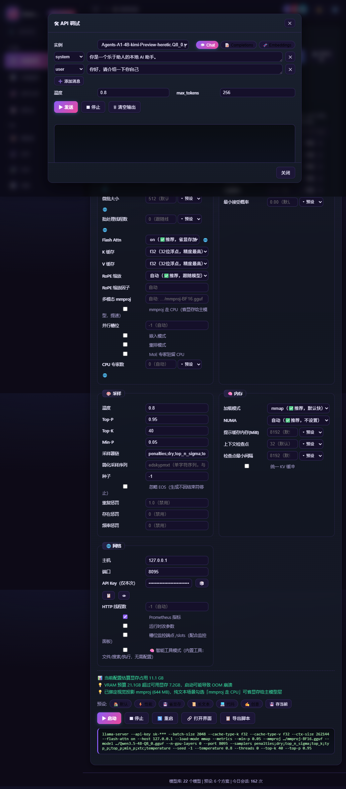
*主界面：模型选择、参数配置、实时命令预览、运行实例与日志控制台（紫色主题）*

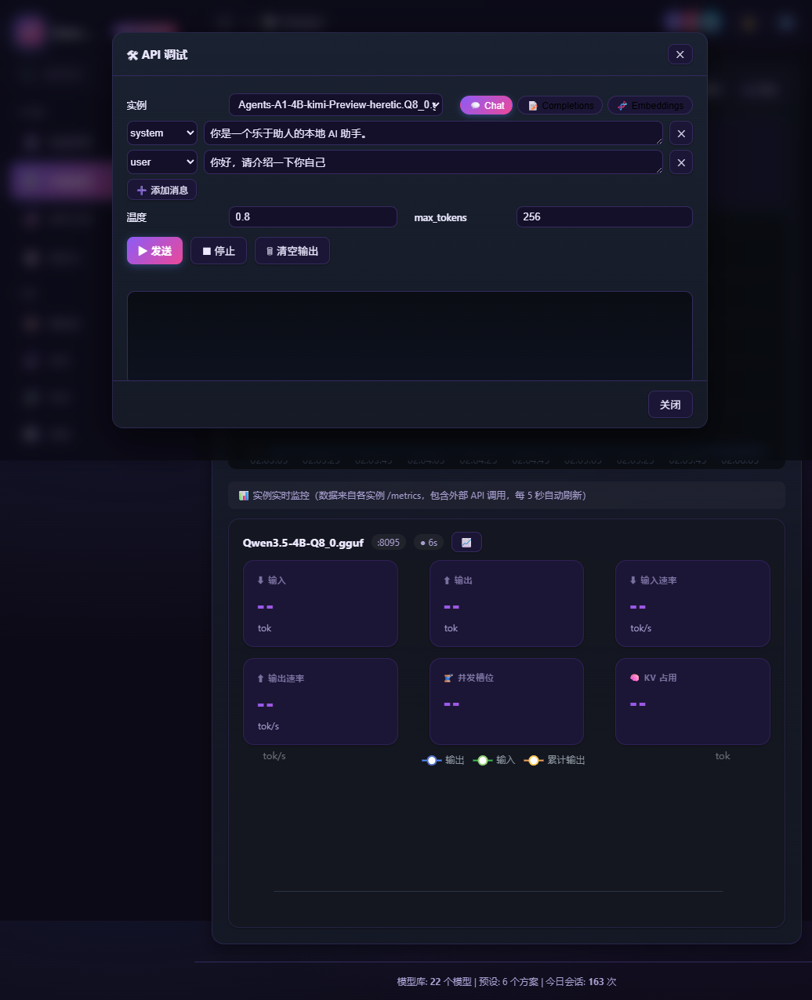
*性能监控：KPI 指标卡、吞吐趋势图、每实例实时监控（输入/输出 token、速率、KV 占用）*

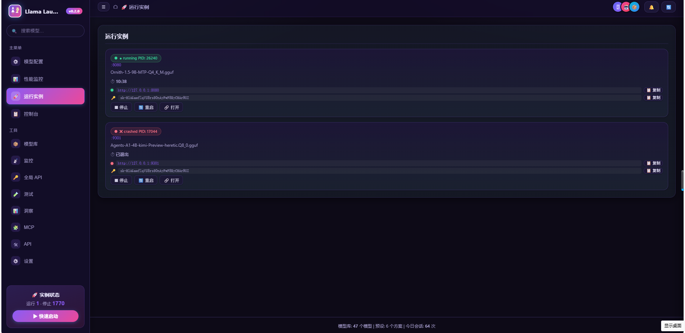
*运行实例：状态徽章、端口、运行时长、一键停止/重启/打开界面*

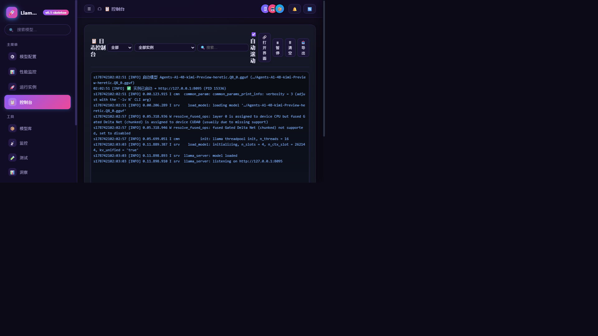
*日志控制台：分级过滤、实例筛选、搜索、自动滚动、导出*

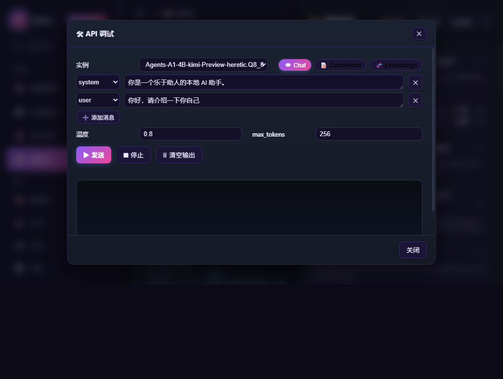
*模型库：扫描导入、智能捆绑（mmproj / MTP / LoRA / 分片）*

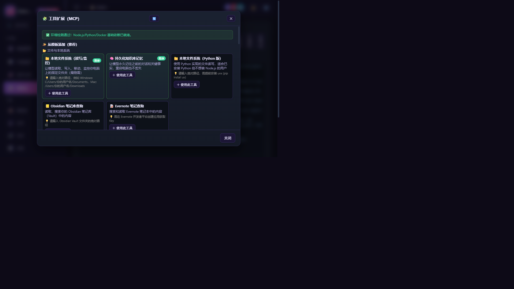
*工具扩展 MCP：模板库一键添加、健康检测、绑定模型*

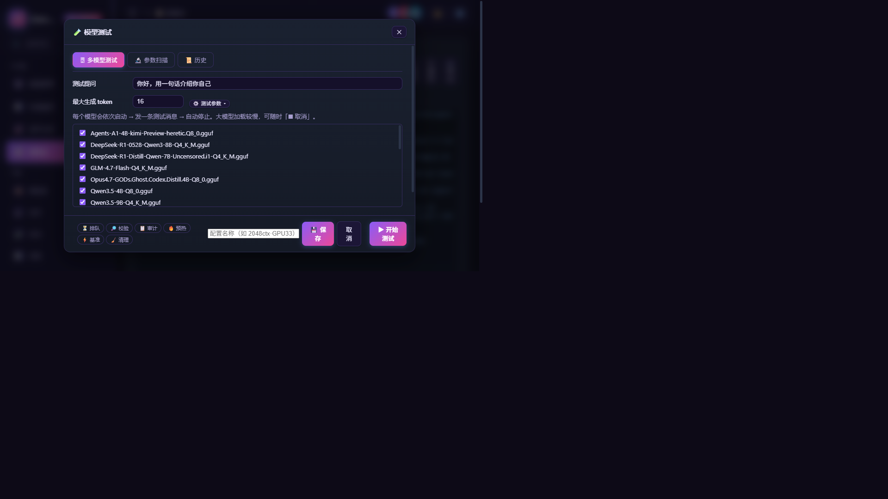
*批量测试与参数扫描：穷举寻优 / 智能寻优*

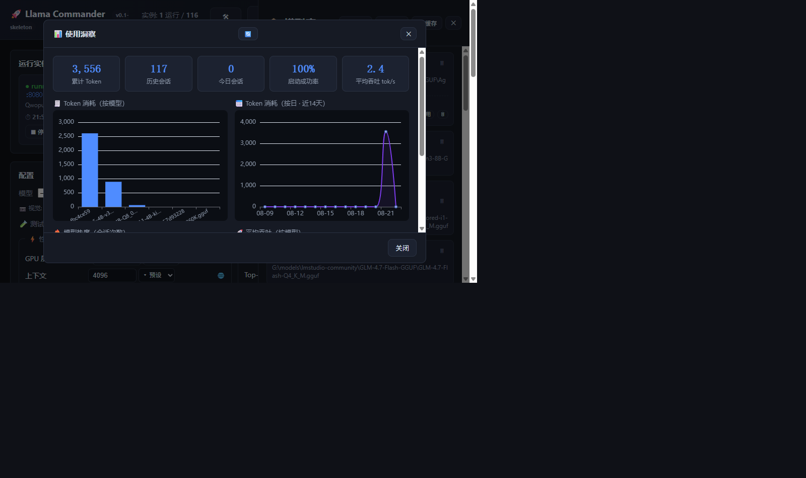
*使用洞察：Token 统计、模型热度、吞吐仪表盘*

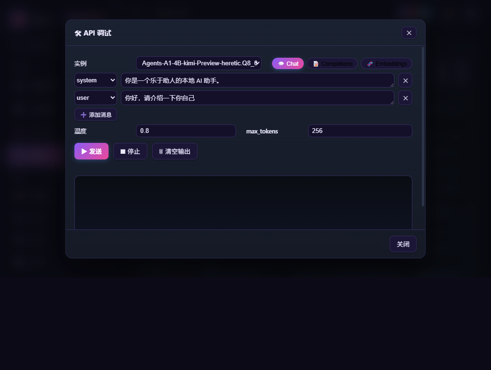
*实时监控：每实例趋势图、请求历史、CSV 导出*

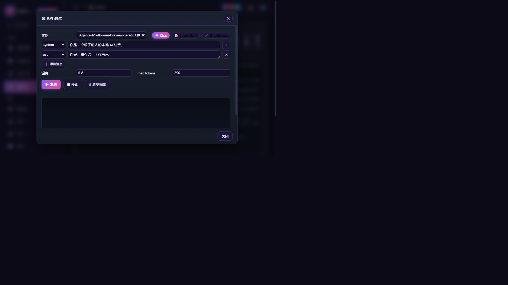
*API 调试：Chat / Completions / Embeddings 一键调试*

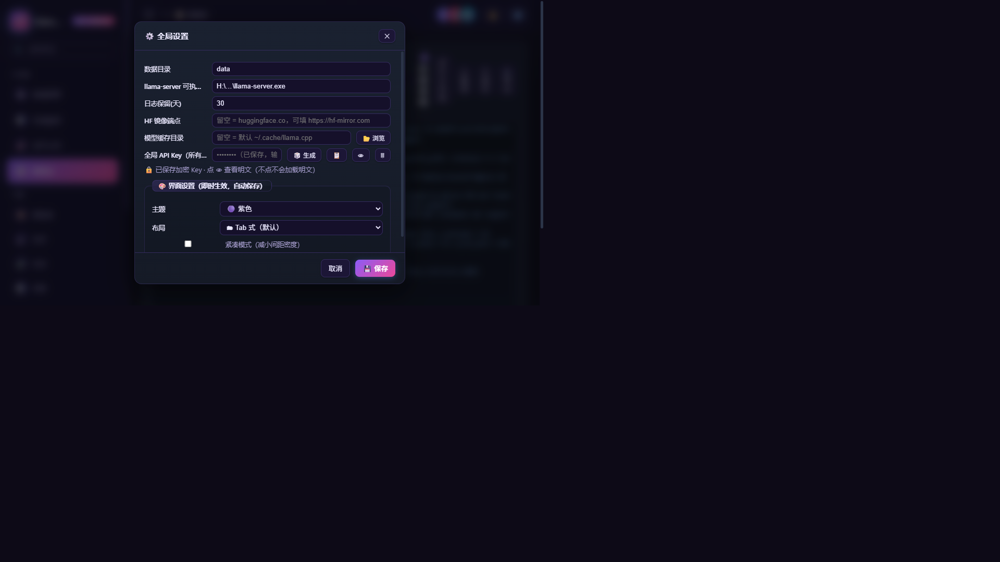
*全局设置：接口地址、API Key 加密存储、界面主题（暗色/奶白/SaaS 浅紫/紫色）*

---

## 🚀 快速开始

### 环境要求
| 组件 | 说明 |
|------|------|
| **Windows / Linux / macOS** | 已提供跨平台构建脚本 |
| **[llama-server](https://github.com/ggml-org/llama.cpp/releases)** | 唯一外部依赖，在 ⚙️ 设置中填写路径 |
| **NVIDIA GPU**（可选） | 使用 CUDA 版 llama-server 时可加速；纯 CPU 也可运行 |
| **Go 1.24+**（仅编译需要） | 运行时不需要任何开发环境 |

### 一键启动（Windows）
```
1. 双击 start.cmd（或运行 scripts\start.ps1）
2. 浏览器自动打开 http://127.0.0.1:8114
3. ⚙️ 设置 → 填入 llama-server 路径
4. 扫描 / 导入模型 → 选择模型 → ▶ 启动
```

### 从源码编译
```bash
# 启动开发服务（默认 127.0.0.1:8080）
go run cmd/server/main.go

# 编译单二进制（前端已内嵌，约 10MB）
go build -o llama-launcher.exe ./cmd/server

# 跨平台打包（Win / Linux / macOS → dist/）
powershell -File scripts/build-all.ps1

# 运行测试
go test ./...
```

### 常用命令
| 命令 | 用途 |
|------|------|
| `go run cmd/server/main.go` | 启动管理器 |
| `go run cmd/server/main.go parse <模型.gguf>` | 单独测试 GGUF 解析 |
| `go build -o llama-launcher.exe ./cmd/server` | 编译 EXE |
| `powershell -File scripts/sync-web.ps1` | 前端镜像同步（改 `internal/webui/dist/` 后运行） |
| `powershell -File scripts/build-all.ps1` | 跨平台打包 |
| `powershell -File scripts/start.ps1 -Port 8114 -NoBrowser` | 自定义端口启动 |

---

## 🏗 目录结构

```
├── cmd/server/main.go          # 主入口（HTTP + WS + 子进程管理 + 测试/扫描引擎）
├── internal/
│   ├── gguf/                   # GGUF v3 头解析（含单元测试）
│   ├── llama/                  # 进程管理（Windows Job Object）+ 健康检测 + 指标解析
│   ├── config/                 # 参数矩阵 / 三级继承链 / 自动配置 / 健康审计
│   ├── bundle/                 # 模型组合包 CRUD / 缓存管理 / 分片检测
│   ├── session/                # 多实例会话管理
│   ├── secure/                 # AES-256-GCM 加密存储
│   ├── downloader/             # Hugging Face 下载（断点续传）
│   ├── fsbrowse/               # 内置文件浏览器
│   ├── mcp/                    # MCP 服务器管理
│   └── webui/                  # 内嵌前端（go:embed，ECharts 5.5）
├── web/dist/                   # 前端镜像副本（勿直接编辑，用脚本同步）
├── data/                       # 运行时数据（config/bundles/sessions/mcp）
├── logs/                       # 会话日志（按日期分目录）
├── binaries/                   # 多版本 llama-server 目录
├── scripts/                    # 启动 / 构建 / 同步脚本
├── start.cmd                   # Windows 一键启动
└── scratch/fakeserver/         # 模拟 llama-server 的端到端测试工具
```

---

## 🌐 HTTP API（节选）

| 方法 | 路径 | 说明 |
|------|------|------|
| GET | `/api/health` | 服务健康 / 版本 |
| GET | `/api/system` | 硬件信息 |
| GET | `/api/bundles` | 模型库列表 |
| POST | `/api/bundles/scan` | 扫描目录（自动捆绑 mmproj/MTP/LoRA） |
| POST | `/api/recommend` | 一键优化（VRAM 估算） |
| GET/POST | `/api/test/sweep` | 参数扫描 / 智能寻优 |
| GET | `/api/sessions` | 实例列表 |
| POST | `/api/sessions/start` | 启动模型 |
| POST | `/api/sessions/{id}/stop` | 停止实例 |
| POST | `/api/debug/proxy` | 向实例转发 OpenAI 兼容请求（SSE 流式） |
| GET/POST | `/api/hf/list` `/api/hf/download` | HF 仓库浏览 / 下载 |
| GET | `/api/config` | 读取全局设置（密钥仅返回布尔） |
| GET | `/api/config/key` | 按需返回解密后的 API Key |
| PUT | `/api/config` | 保存设置（API Key 加密存储） |
| GET | `/api/ws` | WebSocket 日志流 + 指标推送 |

---

## 🛠 技术栈

- **后端**：Go 1.24+（`net/http` + `gorilla/websocket` + `golang.org/x/sys`）
- **前端**：原生 HTML / CSS / JavaScript + ECharts 5.5（CDN，`go:embed` 打包为单文件）
- **安全**：API Key AES-256-GCM 加密存储（`data/.secret` 密钥文件，不落明文）

---

## 📄 License

[MIT](LICENSE) © 2026 [Jiaieyu123](https://github.com/jiaieyu123)

---

*Built with ❤️ for the llama.cpp community.*
